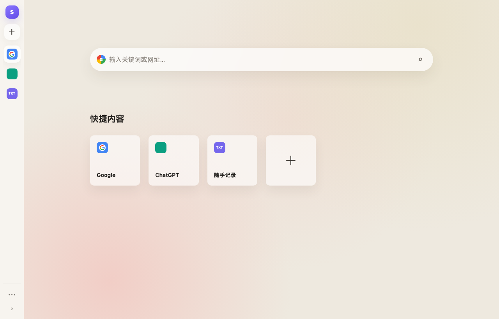

# Sidepad for Windows

一个轻量的 Windows 侧边工作台。平时隐藏在屏幕右侧，鼠标移动到边缘时展开；鼠标和焦点离开后自动收起。

[下载最新版本](https://github.com/syrangg813s7vi-web/sidepad-for-windows/releases/latest) · [设计文档](docs/DESIGN.md) · [Windows x64 验收记录](docs/WINDOWS-VM-VALIDATION.md)



## 下载

当前版本：`v0.1.1`，适用于 Windows 10/11 x64。

| 版本 | 适用场景 | 下载 |
|------|----------|------|
| 安装版 | 推荐日常使用，安装后可直接启动 | [Sidepad Setup 0.1.1 x64](https://github.com/syrangg813s7vi-web/sidepad-for-windows/releases/download/v0.1.1/Sidepad.Setup.0.1.1.exe) |
| 便携版 | 无需安装，适合临时使用或放入移动存储 | [Sidepad 0.1.1 x64 Portable](https://github.com/syrangg813s7vi-web/sidepad-for-windows/releases/download/v0.1.1/Sidepad.0.1.1.exe) |
| 校验文件 | 核对下载文件的完整性 | [SHA256SUMS.txt](https://github.com/syrangg813s7vi-web/sidepad-for-windows/releases/download/v0.1.1/SHA256SUMS.txt) |

安装包自带 Chromium 和文档预览运行时，不需要另外安装 Chrome、Microsoft Office 或 LibreOffice。

> 当前版本尚未配置商业 Authenticode 证书。Windows 可能显示“未知发布者”或 SmartScreen 提示。

## 主要功能

- 在当前显示器右侧边缘唤醒，离开或失焦后自动隐藏。
- 使用窄面板布局，尽量减少对主工作区的遮挡。
- 添加、切换和管理 Chromium 网页，保留独立登录会话。
- 新建本地文本笔记，输入内容自动保存。
- 拖入本地文件并在面板中快速查看。
- 支持双屏/多屏独立触发，面板跟随鼠标所在屏幕。
- 提供后退、前进、刷新、地址栏和系统浏览器打开入口。
- 网页加载失败时显示原因，并可直接重试或改用系统浏览器。

## 支持的内容

| 内容类型 | 支持情况 |
|----------|----------|
| 网页 | 使用应用内置 Chromium 加载 |
| TXT、Markdown、JSON、CSV | 内嵌查看；笔记支持自动保存 |
| PNG、JPG、GIF、WebP、SVG | 内嵌预览 |
| PDF | 使用 Chromium 内嵌预览 |
| DOCX、PPTX、XLSX | 使用安装包内置 JavaScript 渲染器预览 |
| 旧版 DOC、PPT、XLS | 暂不支持内嵌预览，建议转换为新版 Office 格式 |

复杂 Office 动画、宏和部分高级排版可能无法完全还原；Sidepad 不会修改原始文档。

## 基本操作

1. 启动 Sidepad。
2. 将鼠标移动到显示器右侧边缘，等待面板展开。
3. 使用左侧窄轨道添加网页、笔记或本地文件。
4. 将鼠标移出面板并切换焦点，Sidepad 会自动收起。

| 快捷键 | 操作 |
|--------|------|
| `Esc` | 收起面板 |
| `Ctrl+L` | 聚焦网页地址栏 |
| `Ctrl+R` | 刷新当前网页 |

## 开发与构建

需要 Node.js 22 和 npm。

```bash
npm install
npm start
```

运行测试：

```bash
npm test
```

构建 Windows x64 安装版和便携版：

```bash
npm run dist:win:x64
```

生成文件位于 `dist/` 目录。

## 验证状态

`v0.1.1` 的基础功能沿用 Windows 11 Enterprise Evaluation x64 验收结果，并新增网页失败恢复与新窗口导航自动化测试：

- 边缘唤醒和自动隐藏。
- Chromium 网页加载和笔记持久化。
- TXT、DOCX、PPTX、XLSX 内嵌预览。
- 100%/150% DPI 窗口几何和双屏接缝逻辑测试。

真正的双显示器硬件验收仍需要在两个输出均被 Windows 正常识别的设备上补充。详细结果参见 [Windows 虚拟机验收文档](docs/WINDOWS-VM-VALIDATION.md)。

## 设计与实现

- [产品与技术设计](docs/DESIGN.md)
- [设计—代码对应表](docs/DESIGN-CODE-MAP.md)
- [Windows x64 验收记录](docs/WINDOWS-VM-VALIDATION.md)
